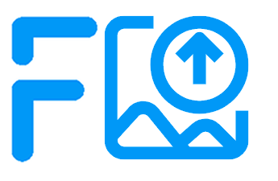
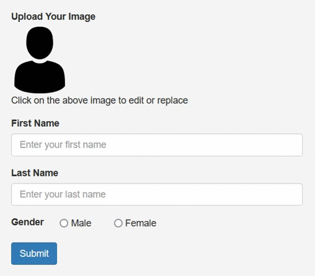
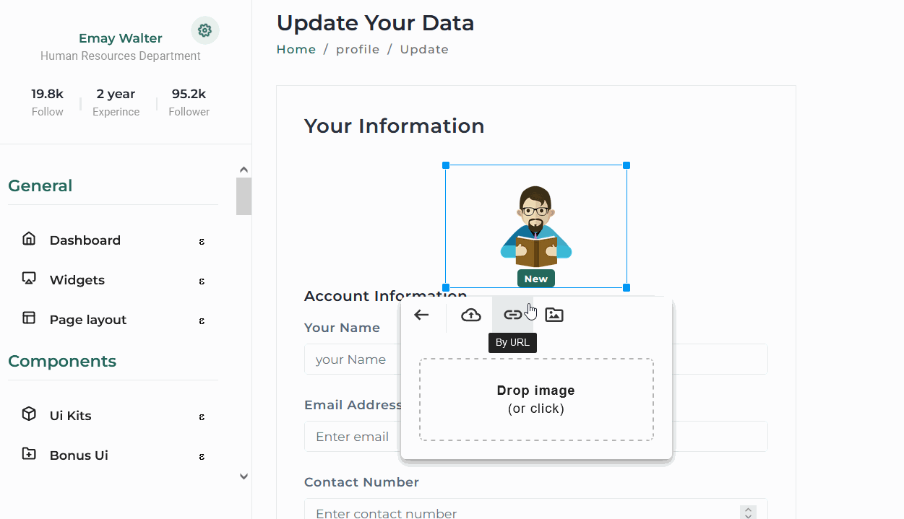
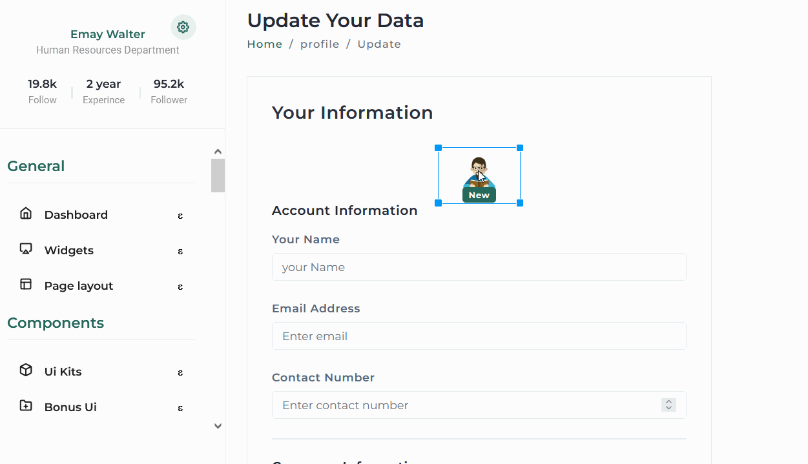
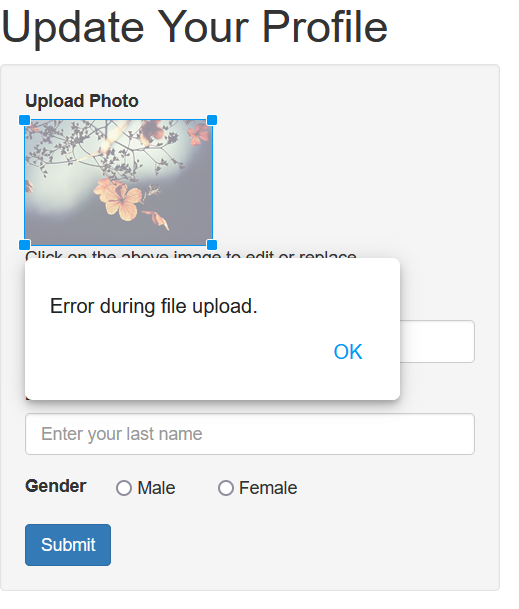

# [Froala image uploader example](https://froala.com/image-uploader/)

Sample PHP application demo for using Froala Image Uploader to upload images to your PHP server. Download the demo and integrate it into your projects and give your users an awesome uploading experience.

## Steps to run the project

- Download the files in to the project folder in a server enviornment supporting PHP
- Run command `composer install` to install Froala SDK and editor source dependecies.
- Open project in browser to see the results
- Note: In this example we are using https://cors-anywhere.herokuapp.com/ to enable uploading images from external URL. In production you need to change this to the proxy server you are using. for testing you have to do the following steps:
  - Open the link https://cors-anywhere.herokuapp.com/corsdemo on a new page
  - Click on "Request temporary access to the demo server" button

The supporting SDK and editor source files are being installed using composer in this example. You can download those directly from https://github.com/froala/wysiwyg-editor-php-sdk and https://github.com/froala/wysiwyg-editor into your project folder and update the path to files respectively.

## Documentation
 * [Toturial](https://froala.com/image-uploader/handle-user-profile-image-php-tutorial/)
 * [Froala Editor API](https://froala.com/wysiwyg-editor/docs/api/)
 * [SDK documentation](https://www.froala.com/wysiwyg-editor/docs/sdks/php)
 * [Froala Image plugin documentation](https://froala.com/image-plugin/)
 * [Froala Image Manager plugin documentation](https://froala.com/image-manager-plugin/)

## Dependencies

PHP version >= 5.4.0 is required.

The following PHP extensions are required:

* fileinfo
* imagick

Note: imagick extension is requried for resizing the image on the server-side, if you will not use it and don't want to enable it you can remove it form "project folder/vendor/froala/wysiwyg-editor-php-sdk/lib/FroalaEditor.php" file.

## Main features ✅

 - Upload from device, drag-and-drop or external URL.
 - Image Manager Included.
 

 - Support Amazon S3 uploads.
 - Image previews.
 - Progress updates.
 - Looks nice in any form. The placeholder image can be any image from your choice.
  

 - Image resizing.
 

 - File validation and error handling.

   

 - Well tested

## License

The Froala image uploader is free.  However, in order to use Froala WYSIWYG HTML Editor for other propuses than image uploading, you should purchase a [license](http://froala.com/wysiwyg-editor/pricing) before using it on your live projects.

## Help
- Found a bug or have some suggestions? Just submit an [issue](https://github.com/froala/froala-image-uploader-example/issues).
- Having trouble with your integration? [Contact Froala Support team](http://froala.com/wysiwyg-editor/contact).
